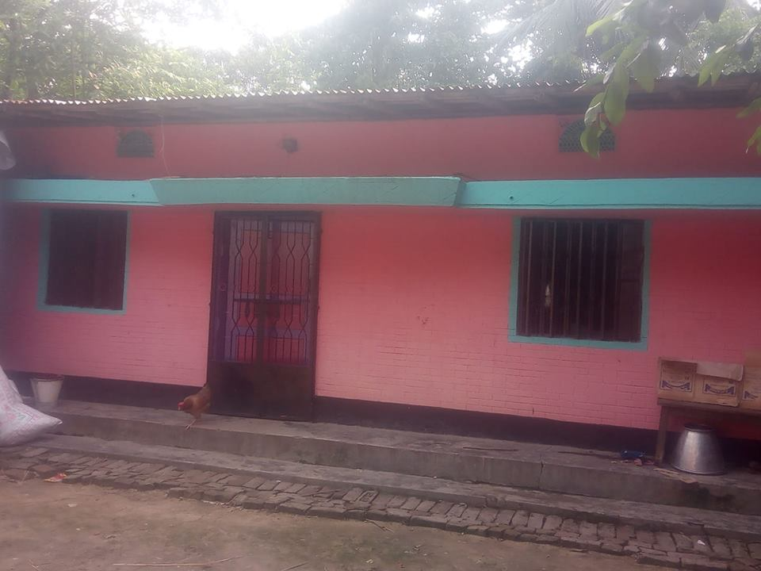
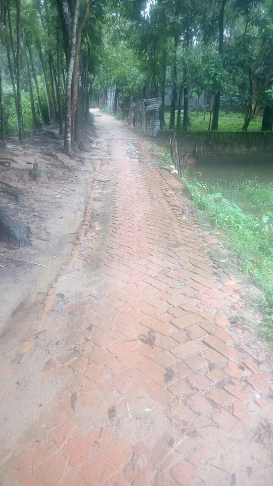
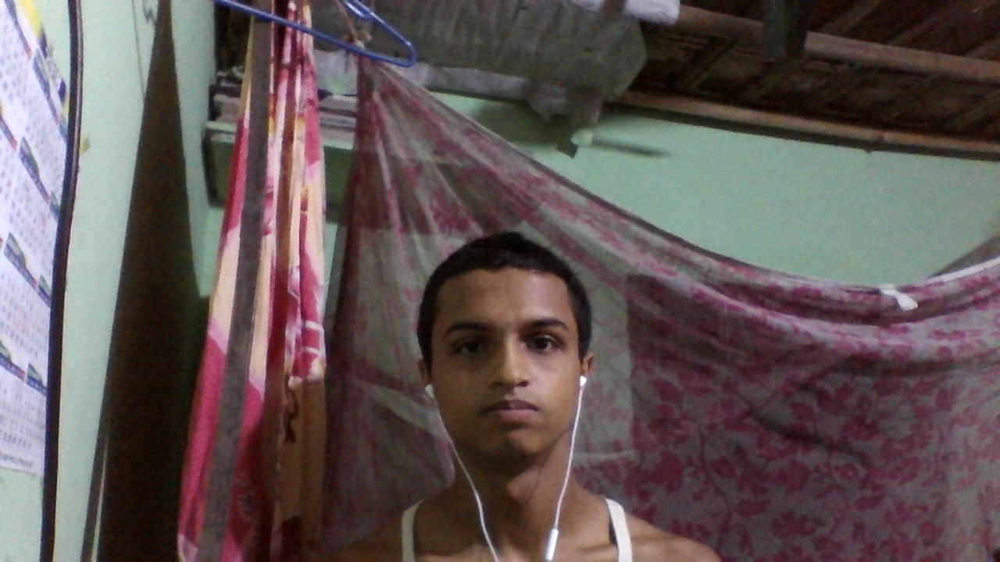
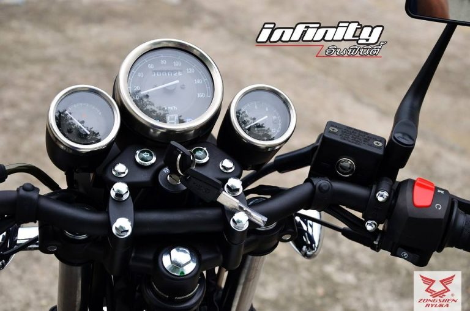

<!doctype html>
<html lang="en">
  <head>
    <!-- Required meta tags -->
    <meta charset="utf-8">
    <meta name="viewport" content="width=device-width, initial-scale=1, shrink-to-fit=no">

    <!-- Bootstrap CSS -->
    <link rel="stylesheet" href="https://stackpath.bootstrapcdn.com/bootstrap/4.1.1/css/bootstrap.min.css" 
integrity="sha384-WskhaSGFgHYWDcbwN70/dfYBj47jz9qbsMId/iRN3ewGhXQFZCSftd1LZCfmhktB" crossorigin="anonymous">

    <title>Omar Farok</title>

  </head>
  <body>
<nav class="navbar navbar-expand-lg navbar-dark bg-dark sticky-top">
  <button class="navbar-toggler" type="button" data-toggle="collapse" data-target="#navbarNav" aria-controls="navbarNav" aria-expanded="false" 
aria-label="Toggle navigation">
    
  </button>
  

    <ul class="navbar-nav">
      <li class="nav-item">
        <a class="nav-link" href="#hhoommee"> হোম</a>
      </li>
        <li class="nav-item">
        <a class="nav-link" href="#socita"> সূচনা</a>
      </li>
        <li class="nav-item">
        <a class="nav-link" href="#life"> লাইফস্টাইল </a>
      </li>
       <li class="nav-item">
        <a class="nav-link" href="#তিনটি ফিচার">তিনটি ফিচার</a>
      </li>
      <li class="nav-item">
        <a class="nav-link" href="#শিক্ষাজীবন">শিক্ষাজীবন</a>
      </li>
      <li class="nav-item">
        <a class="nav-link" href="#পছন্দ ও অপছন্দ">পছন্দ ও অপছন্দ</a>
      </li>
      <li class="nav-item">
        <a class="nav-link" href="#itikhota">ইতি কথা</a>
      </li>
    </ul>
  

</nav>

  <ol class="carousel-indicators">
    <li data-target="#carouselExampleIndicators" data-slide-to="0" class="active"></li>
    <li data-target="#carouselExampleIndicators" data-slide-to="1"></li>
    <li data-target="#carouselExampleIndicators" data-slide-to="2"></li>
  </ol>
  

    

      
    

    

      
    

    

      
    

  

  <a class="carousel-control-prev" href="#carouselExampleIndicators" role="button" data-slide="prev">
    
    Previous
  </a>
  <a class="carousel-control-next" href="#carouselExampleIndicators" role="button" data-slide="next">
    
    Next
  </a>

  

  <h1 class="display-4"> আমার ওয়েবপেজে আপনাকে স্বাগতম। </h1>
  
 আমি সিম্পল একজন মানুষ। আমার জীবনে লক্ষ্য হলো আইটি প্রফেশনাল রিলেটেড কিছু একটা করা। যদিও আমার দ্বারা এটা হওয়া অনেক ডিফিকাল্ট।

  

  
 আমি গ্রামে থাকি। কিন্তু বিশ্বটাকে চিনতে চায়। একাডেমিক লেখাপড়া করতে আর ইচ্ছে করছে না। হয়তো এ বছর বা আগামী বছর একাডেমিক লেখাপড়া ছেড়ে দিচ্ছি। তবে অনলাইনে পড়াশোনা করার ইচ্ছা আছে। 

  <a class="btn btn-primary btn-lg" href="https://web.facebook.com/profile.php?viewas=100000686899395&privacy_source=timeline_gear_menu">আরোও জানতে!</a>

  

  

    লাইফস্টাইল
  

  

 <h5 class="card-title">যেভাবে ২৪ ঘন্টা কাটায়ঃ-</h5>
    
আমি সাধারণত সকালে ৫ টা বাজে ঘুম থেকে উঠি। মাঝের মধ্যে আরো দেরি হয়ে যায়। তারপর দাঁত মাজি। আর সম্ভব হলে কানিকক্ষণ ইবাদত করার চেষ্টা করি। এরপর হাঁটাহাঁটি করে ৭টা বাজে সকালের নাস্তা খায়। এরপর ঘরের টুকটাক কাজ করি। সাড়ে ৯টায় মাদরাসায় যাওয়ার জন্য তৈরি হয়।
১০ টায় মাদ্রাসায় যায়। তবে ক্লাস শুরু হতো সাড়ে ১০ টায়। তারপর থেকে দোকানে (আমার বাবার একটা দোকান আছে) বসি বা কোনো একটা কাজ করি। এরপর দুপুর ১ টায় গোসল করে দুপুরের খাবার খায়। তারপর ছোট্ট একটা ঘুম দিয়। সাড়ে ৪ টায় বা ৫ টায় ঘুম থেকে উঠি। তারপর মোবাইলে ভিডিও দেখি। আর সন্ধ্যা বেলায় পড়তে বসি। তারপর
 রাত্রের খাবার খায়। ১০ টায় একটু টিবি দেখে। তারপর লং টাইম ঘুম দিয়ে একবারে সকালে ঘুম থেকে উঠি।  

  

 

  

    
    

      <h5 class="card-title">মোড মারি বটে!</h5>
      
 আয়নার সামনে আসলে আমার মোড ২ ডিগ্রি বেড়ে যায়। তখন মনে মনে ভাবি "এই ফারুক যাকে তাকে পাত্তা দিবি না।" মেয়েদের কে তো একদম না। উক্ত ২ ডিগ্রি আমাকে বাতাসে উড়ায়। 

      
<small class="text-muted"></small>

    

  

  

    
    

      <h5 class="card-title"> রঙ্গে পেলে!</h5>
      
 মাঝের মধ্যে আমার মনে অনেক রং ওঠে। তখন আর কি করব সামনে যাকে পায় তাকে বলি "এই একটা সেলফি তুল"। আর যখন সেলফি সুন্দর হয়না তখন বলি, এটা কি সেলফি তুলচছ! 

      
<small class="text-muted"></small>

    

  

  

    
    

      <h5 class="card-title"> কাজের ফাঁকে!  </h5>
      
আমি কাজে আনন্দ পাওয়ার জন্য মাঝের মধ্যে গানও শুনি। তারপর ফ্রেন্ডের সাথে আড্ডা তো থাকেই। মাঝের মধ্যে সুন্দর সুন্দর মোভি, নাটক দেখি বটে! মোটকথা কাজের মধ্যে আনন্দ তো করতেই হবে। 

      
<small class="text-muted"></small>

    

  

  

  

    শিক্ষাজীবন
  

  

 <h5 class="card-title">আলিম ১ম বর্ষ (অধ্যয়নরত);</h5>
    
 রাঊজান কদলপুর হামেদীয়া ফাযিল (ডিগ্রি) মাদরাসা।

    <h5 class="card-title">ইবতেদায়ী, জেডিসি ও দাখিল;</h5>
    
 রাঊজান খলিলাবাদ হাফেজিয়া বারেবীয়া হামেদীয়া মুনিরীয়া আলাভীয়া দাখিল মাদরাসা।

   
  

  

    

      

        <h5 class="card-title">আমার কয়েকটি পছন্দ সম্পর্কে</h5>
        
১। সিমঃ- "রবি কারণ তারা একটু বেশি দেয়। এই দেশে যখন চলে 3জি তখন রবি আধা কেজি বাড়িয়ে 3.5 জি দেয়। যখন অন্য সিমগুলো দিবে 4 জি 5 জি 6 জি তখন আমার বিশ্বাস রবি আরো আধা কেজি বেশি দিবে।"    ২।ওজনঃ- "ওরশের মেলাতে দু'টাকা দিয়ে মেপে দেখতে হবে" 
  ৩।পোশাকঃ- "জাতীয় পোশাক লুঙি"   ৪।গানঃ- "চলে গেছ তাতে কি নতুন একটা পেয়েছি, বেদের মেয়ে জ্যোৎস্না আমায় কথা দিয়েছে" ৫।খাবারঃ "চানাচুরররর"   ৬।হাসিঃ- "যে ছেলে বা মেয়ে বেশি পার্ট মারতে গিয়ে কলার খসায় পিছলে পড়ে! তারপর হা হা হাহাহাহাহাআ"   ৭।উচ্চতাঃ- "এলাকার
 রাজমিস্ত্রী ভাইদের কাছ থেকে মিটার রুল নিয়ে মেপে দেখতে হবে।"   ৮।ঝগড়াঃ- " আধার মাইর, গণধোলায় ও মেয়ে মানুষের মারামারি কারে বলে!"   ৯। গালিঃ- "তোর চৌদ্দ খান্দানকে অহরহ সালাম"   ১০। প্রযুক্তিঃ- "স্মার্টফোন কারণ এটা দিয়ে অনেক কিছু করা যায়। ঘরে বসে বসে নাটক, সিনেমা, ফানি ভিডিও ও পর্নগ্রাফি বা
 অনলাইন ক্লাসও করা যায়।  ১১। খেলাঃ- "ক্রিকেটে বাংলাদেশকে আর ফুটবলে জার্মানীকে সার্পোট করি। যদিও আমি খেলা দেখার জন্য মরিয়া না বলতে পারেন ফাট্টু সার্পোটার।"

        
      

    

  

  

    

      

        <h5 class="card-title">আমার কয়েকটি অপছন্দ সম্পর্কে </h5>
        
১।"সমাজের গালাগালি তো একদম ভালো লাগে না যেমনঃ মাগির পোওয়া ইত্যাদি"   ২। "গ্রার্লফ্রেন্ডকে পায়ে নূপুর পরিয়ে যখন ছেলেটা বলে 'উমম তোমার পায়ে কি গন্ধ' "   ৩। "অনেকের সামনে কাঊরে শুধু শুধু বেইজ্জতি করলে"   ৪। "সমাজের ছোট্ট 
পেশাদারীদের ঘূণা করলে"   ৫। "গ্রার্লফ্রেন্ডের সাথে হেসে হেসে ট্রেক্সট করার সময় দুনিয়াদারী ভুলে গেলে"   ৬। "অন্যায়ভাবে নিজের বন্ধুর গ্রার্লফ্রেন্ড বা ব্রয়ফ্রেন্ডের সাথে লাইন মারলে"    ৭। "যখন পরীক্ষার হলে টিচাররা আমাকে কড়া পাহারা দেয়। "  ৮। "ফাস্ট ইয়ার ডেম কেয়ারে
 যখন সবার সামনে টিচার বলে 'এই ছেলে কানে দর'"  ৯। "কোথাও দাওয়াতে গেলে যখন বয় খানা আনতে দেরি করে"   ১০। "একটি মেয়ে যখন তার ব্রয়ফেন্ডকে পাওয়ার ব্যাংক, শার্ট ইত্যাদি    দেয় তখন ছেলেটা তার গ্রার্লফেন্ডকে সামনে পকেট থেকে বের করে দেয়   দশ টাকার 'পোতা বাদাম',
এখানে ছেলেটি মেয়েটিকে তো পাত্তা দিচ্ছে না, যেটা করা উচিত মেয়েটির - সূত্রঃ 'বড় ছেলে' নাটকের হাতে।"

      

    

  

  

  

   <h5> কয়েকটি বদঅভ্যাস সম্পর্কেঃ- </h5>

 আমি কোনো ধরণের সিগারেট খায়না। মদ , গাঁজা, হিরোইন ইত্যাদি তো না।     বিঃদ্রঃ- "আমি নিয়মিত K তে 'X'দেখার চেষ্টা করি"   

  

 <blockquote class="blockquote text-right">
  
আমরা সবাই যেন সারাক্ষণ হাসি আর খুশিতে থাকি এই আমার কামনা। আর সবাইকে 'বেস্ট অফ লাক'।

  <footer class="blockquote-footer">ওমর ফারুক, রাউজান, চট্রগ্রাম। </footer>
</blockquote>

    <!-- Optional JavaScript -->
    <!-- jQuery first, then Popper.js, then Bootstrap JS -->
    

  </body>
</html>
